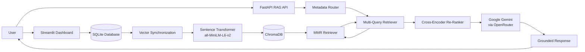
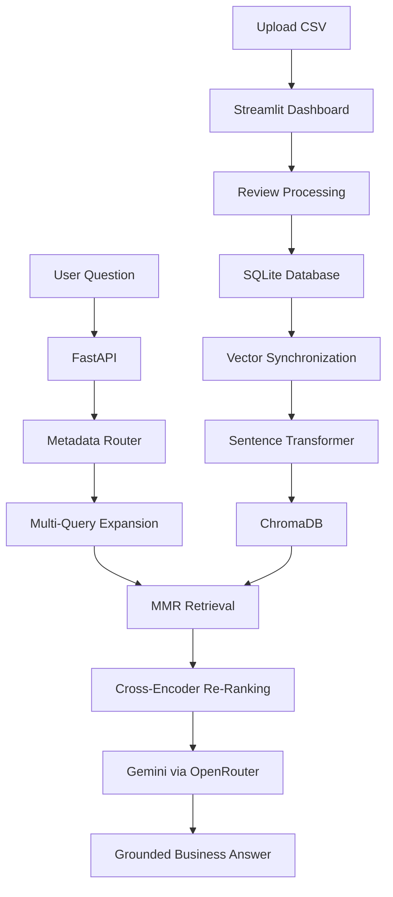

# 📊 BizInsight AI

BizInsight AI is an AI-powered customer feedback analytics platform that helps businesses understand customer sentiment, identify key issues, track satisfaction trends, and receive intelligent improvement suggestions.

Built as a real-world business intelligence tool using Python, Streamlit, and advanced AI models.

---

## 🚀 Features

- Upload customer feedback CSV files  
- Automatic sentiment analysis  
- **Smart complaint clustering** – automatically groups negative reviews into business‑relevant categories (Payment, Delivery, Technical, Account, Product Quality, Customer Service, etc.)  
- **Website integration chatbot** – embeddable widget that answers customer questions based on your reviews. 
- Trend tracking over time  
- Top issue detection  
- AI-powered business assistant  
- Persistent data storage  
- Clean dashboard UI  

---

## 🧠 AI Capabilities

- Understands customer pain points  
- Identifies repeating issues  
- Suggests improvement actions  
- Provides business-style insights  
- **Unsupervised topic modelling** – finds hidden complaint patterns without manual labelling  

---

## 🛠 Tech Stack

- Python  
- Streamlit  
- Pandas, Matplotlib  
- Scikit-learn  
- **VADER (NLTK)** (sentiment analysis)  
- **BERTopic** + **HDBSCAN** + **UMAP** (clustering)  
- **Sentence‑Transformers** (`all-mpnet-base-v2`)  
- **LangChain** (RAG pipeline)  
- **ChromaDB** (vector database)  
- **FastAPI** (RAG backend)  
- **OpenRouter** (LLM gateway, Google Gemini)  
- SQLite  

---

## 🔍 Smart Complaint Clustering (Core Feature)

This module automatically groups customer complaints into meaningful clusters, names them (e.g., `"Payment Issues"`, `"Delivery Issues"`).

### How it works

1. **Preprocessing** – removes numbers, `#`, punctuation (keeps apostrophes). No stopword removal – preserves meaning.  
2. **Embedding** – converts reviews into vectors using a Sentence‑Transformer (`all-mpnet-base-v2` or fine‑tuned model).  
3. **Dimensionality reduction** – UMAP (5 components, cosine distance).  
4. **Clustering** – HDBSCAN (density‑based, automatically marks noise as outliers).  
5. **Topic extraction** – BERTopic extracts c‑TF‑IDF words.  
6. **Category mapping** – each cluster is compared to 11 predefined category descriptions (Payment, Delivery, Technical, Account, Product Quality, Customer Service, Shipping Damage, Subscription, Checkout, Return/Refund). If similarity ≥ threshold, the cluster gets a standard name; otherwise it receives a dynamic name generated from the two most frequent content words + suffix (`Issues` / `Error` / `Delay`).  
7. **Merge duplicates** – clusters with the same name are combined.

### How to use it in the dashboard

1. Upload a CSV with a `review` column.  
2. Go to the **Dashboard** tab and click **“Find Complaint Clusters”**.  
3. Wait for the analysis (first run loads the embedding model).  
4. Expandable clusters – each shows name, number of reviews, some complaints.

## 🧠 RAG Chatbot – Ask Your Reviews

A dedicated conversational AI that answers business questions based **only** on the uploaded customer reviews.

### How it works

1. **Vector Store – Embeddings & Storage**
Customer reviews are converted into 384‑dimensional vectors using `all-MiniLM-L6-v2` and stored in ChromaDB along with metadata (sentiment, date). The vector store is re‑synced automatically after every CSV upload. 
2. **Smart Retrieval – Finding the Right Reviews**
When a user asks a question, the backend does three things:

Sentiment filtering – if the question mentions “problem”, “issue”, etc., only negative reviews are retrieved; for “good”, “great” etc., only positive reviews are used.

Multi‑Query expansion – the LLM generates 3 rephrased versions of the question to catch more relevant reviews (improves recall).

Cross‑encoder re‑ranking – a neural model (`ms‑marco-MiniLM‑L‑6‑v2`) scores each candidate review and keeps only the top‑8 most relevant ones (improves precision).  
3. **LLM Answer – Grounded & Strict**
The top‑8 reviews are inserted into a strict prompt that instructs the LLM (Google Gemini via OpenRouter) to answer only based on the provided context. If the answer is not in the reviews, the model says “The customer reviews do not mention this information.”
4. **Conversation Memory – Follow‑up Questions**
Session‑based memory (ConversationBufferMemory) keeps the chat history. The user can ask follow‑up questions without repeating context, and the retrieval automatically incorporates sentiment‑aware filtering for each new turn.

### How to use it

1. Start the FastAPI backend (separate terminal):  
   ```bash
   python run_chatbot_api.py

# 🏗️ Architecture & Data Flow

BizInsight AI uses a modular **Retrieval-Augmented Generation (RAG)** architecture that combines **Streamlit**, **FastAPI**, **SQLite**, **ChromaDB**, **Sentence Transformers**, and **Google Gemini (via OpenRouter)** to provide grounded answers based only on uploaded customer reviews.

The system separates data storage, vector search, retrieval, and language generation into independent components, making it easier to maintain and extend.

---

## System Architecture


---

## Architecture Components

## 1. Streamlit Dashboard

The Streamlit application acts as the primary user interface.

It allows users to:

- Upload customer review CSV files
- Run sentiment analysis
- Explore business analytics
- Launch complaint clustering
- Interact with the AI chatbot

Uploaded reviews are processed before being stored in SQLite.

---

## 2. SQLite Database

SQLite serves as the application's persistent storage layer.

It stores:

- Customer reviews
- Sentiment values
- Upload timestamps
- User information
- Chat history

The vector database is built using review data stored in SQLite.

---

## 3. Vector Synchronization

The project includes two synchronization mechanisms:

- `sync_vectors.py`
- FastAPI `/sync` endpoint

Both convert customer reviews into LangChain `Document` objects before generating embeddings and storing them inside ChromaDB.

Each document contains:

- Review text
- Sentiment metadata
- Upload date
- Review ID

> **Note:** CSV uploads store reviews in SQLite. Vector synchronization is performed separately through the provided synchronization utilities.

---

## 4. Embedding Generation

Every customer review is converted into a dense vector using:

```text
all-MiniLM-L6-v2
```

The embedding model is loaded only once and reused throughout the application to reduce initialization overhead and improve performance.

Embeddings are normalized before storage to improve similarity search quality.

---

## 5. ChromaDB Vector Store

Embedded reviews are stored inside a persistent ChromaDB collection.

Configuration includes:

- Persistent storage directory
- Collection name
- Metadata storage
- Maximum Marginal Relevance (MMR) retrieval

Each stored vector retains metadata, allowing efficient filtering during retrieval.

Example metadata:

- Sentiment
- Date
- Review ID

---

## 6. FastAPI Backend

The FastAPI backend exposes the chatbot API.

Available endpoints include:

| Endpoint | Purpose |
|----------|----------|
| `/chat` | Answer questions using RAG |
| `/sync` | Synchronize documents into ChromaDB |
| `/health` | Check API and vector store health |

The backend coordinates:

- Retrieval
- Query expansion
- Re-ranking
- Prompt generation
- LLM inference

---

## 7. Smart Metadata Router

Before retrieval begins, the backend analyzes the user's question.

If the question indicates **negative intent**, retrieval is restricted to reviews with negative sentiment.

Examples include:

- issue
- problem
- complaint
- broken
- bad

If the question indicates **positive intent**, retrieval is restricted to positive reviews.

Examples include:

- good
- great
- best
- awesome
- love

If no sentiment is detected, the retriever searches across all reviews.

This improves retrieval precision without requiring additional prompts.

---

## 8. Maximum Marginal Relevance (MMR) Retrieval

Instead of performing a standard similarity search, the retriever uses **Maximum Marginal Relevance (MMR)**.

MMR balances:

- similarity
- diversity

This helps avoid retrieving multiple nearly identical reviews while still preserving relevance.

---

## 9. Multi-Query Expansion

The chatbot uses LangChain's **MultiQueryRetriever**.

Instead of searching with only the original question, multiple semantic variations are generated.

For example:

User question:

> Why are customers unhappy with delivery?

Possible search variants:

- Delivery complaints
- Shipping delays
- Late deliveries
- Courier problems

Searching multiple semantic variants improves recall and increases the likelihood of retrieving useful reviews.

---

## 10. Cross-Encoder Re-Ranking

Retrieved reviews are passed through the Hugging Face Cross-Encoder:

```text
cross-encoder/ms-marco-MiniLM-L-6-v2
```

Unlike vector similarity, the cross-encoder jointly evaluates the user's question and every retrieved review.

The highest-scoring reviews are selected before sending context to the language model.

This additional ranking stage significantly improves response quality.

---

## 11. LLM Response Generation

The selected customer reviews are inserted into a carefully designed prompt before being sent to:

```text
Google Gemini
(via OpenRouter)
```

The prompt instructs the model to:

- Use only retrieved customer reviews
- Avoid making unsupported claims
- Return a fallback response if evidence is unavailable

When no supporting review exists, the chatbot responds with:

> "The customer reviews do not mention this information."

This ensures grounded and reliable answers.

---

## 12. Conversation Memory

For conversational sessions, BizInsight AI maintains context using conversation memory.

Conversation history is preserved using:

- Session IDs
- SQLite chat history
- Memory window configuration

This enables follow-up questions without requiring users to repeat previous context.

---

## Data Flow

The following diagram illustrates how customer reviews move through the RAG pipeline.



---

## End-to-End RAG Pipeline

### Step 1 — Upload Customer Reviews

Users upload customer review CSV files through the Streamlit dashboard.

The application processes the reviews, performs sentiment analysis, and stores the processed records inside SQLite.

---

### Step 2 — Synchronize the Vector Store

Stored reviews are converted into LangChain `Document` objects.

Each document includes:

- Review text
- Sentiment
- Timestamp
- Review identifier

The synchronization utilities generate embeddings for every review and store them in ChromaDB.

---

### Step 3 — Ask a Business Question

Users submit natural language questions through the chatbot.

Example:

> What are the most common delivery complaints?

---

### Step 4 — Metadata Routing

The backend first determines whether the question has positive or negative intent.

Depending on the detected intent, retrieval is optionally filtered using sentiment metadata stored inside ChromaDB.

---

### Step 5 — Expand the Query

The Multi-Query Retriever generates multiple semantic variations of the user's question.

This increases retrieval recall by searching for conceptually similar wording across the review collection.

---

### Step 6 — Retrieve Candidate Reviews

Relevant reviews are retrieved using **Maximum Marginal Relevance (MMR)**, balancing similarity with diversity to reduce duplicate context.

---

### Step 7 — Re-Rank Retrieved Reviews

Candidate reviews are scored using the Hugging Face Cross-Encoder model.

Only the most relevant reviews are retained for the final context.

---

### Step 8 — Generate the Final Response

The selected reviews are inserted into the LLM prompt and sent to Google Gemini through OpenRouter.

The model generates a business-focused response using only the supplied customer review context.

If no relevant information is found, the predefined fallback response is returned.

---

## Component Interaction Summary

| Component | Responsibility |
|-----------|----------------|
| **Streamlit** | User interface, CSV uploads, analytics dashboard |
| **SQLite** | Persistent storage for reviews and chat history |
| **Vector Synchronization** | Converts stored reviews into LangChain documents |
| **Sentence Transformer** | Generates dense vector embeddings (`all-MiniLM-L6-v2`) |
| **ChromaDB** | Persistent vector database |
| **FastAPI** | RAG backend and API endpoints |
| **Metadata Router** | Applies sentiment-aware filtering before retrieval |
| **MMR Retriever** | Retrieves relevant and diverse customer reviews |
| **Multi-Query Retriever** | Improves retrieval recall using query expansion |
| **Cross-Encoder** | Re-ranks retrieved reviews by semantic relevance |
| **Google Gemini (OpenRouter)** | Generates grounded business answers |
| **Conversation Memory** | Preserves conversational context across sessions |

## 📂 Project Structure
```
bizinsight-ai/
├── app.py
├── database.py
├── run_chatbot_api.py
├── sync_vectors.py
├── rag_api /
    ├── api.py
    ├── chains.py
    ├── config.py
    ├── embeddings.py
    ├── vector_store.py
├── clustering/
    ├── run_clustering.py
    ├── preprocess.py
    ├── vectorize.py
├── models/finetuned_complaint_model_final
├── data / reviews.csv
├── tests / 
    ├── product_reviews_1000.csv
    ├── test1.csv
    ├── test2.csv
    ├── test3.csv
```
---

## 📥 How to Run Locally

### Install dependencies
```
pip install -r requirements.txt

streamlit run app.py
```

---

### 5. **Requirements.txt** – update to match actual imports

```txt
streamlit
pandas
matplotlib
scikit-learn
nltk
sentence-transformers
langchain
langchain-community
langchain-chroma
langchain-openai
chromadb
hdbscan
umap-learn
fastapi
uvicorn
python-dotenv
openai
requests
```
---

## 📥 Installation & Setup

Follow these steps to set up the project locally on your machine.

### 1. Clone the Repository
Open your terminal and run:
```bash
git clone https://github.com/Prateekiiitg56/BizInsight-AI.git
cd BizInsight-AI
```

### 2. Set Up a Virtual Environment
Choose **one** of the options below to isolate your project dependencies.

#### Option A: Using Standard Python (venv)
* **Create the environment:**
  ```bash
  python -m venv venv
  ```
* **Activate the environment:**
  * **Windows:**
    ```bash
    venv\Scripts\activate
    ```
  * **macOS / Linux:**
    ```bash
    source venv/bin/activate
    ```

#### Option B: Using Anaconda (conda)
* **Create and activate the environment:**
  ```bash
  conda create --name BizInsight-AI-env python=3.10 -y
  conda activate BizInsight-AI-env
  ```

### 3. Install Dependencies
Once your virtual environment is active, install the required packages:
```bash
pip install -r requirements.txt
```

### 4. Set Up Environment Variables

1. Create a free account at [OpenRouter](https://openrouter.ai/) and get your API key.

2. Copy the example env file:
   - **macOS / Linux:**
```bash
     cp .env.example .env
```
   - **Windows:**
```bash
     copy .env.example .env
```

3. Open the `.env` file and add your API key:
```
   OPENROUTER_API_KEY=your_api_key_here
```

> ⚠️ Never share or commit your `.env` file. It is already listed in `.gitignore`.

---

### 5. Run the Application
Start the Streamlit dashboard:
```bash
streamlit run app.py
```
---

## 🐳 Run with Docker

You can run BizInsight AI in a container with no local Python setup.

### 1. Set your API key
Either create a `.env` file in the project root:
```bash
echo "OPENROUTER_API_KEY=your_api_key_here" >> .env
```
or export it directly in your shell (useful for CI/CD or production):
```bash
export OPENROUTER_API_KEY=your_api_key_here
```

### 2. Build and start the app
```bash
docker compose up --build
```

The dashboard will be available at **http://localhost:8501**.

### Notes
- Customer feedback data and vector embeddings are stored in Docker-managed named volumes, so they persist across `docker compose down` / `up` and rebuilds. To fully reset, run `docker compose down -v`.
- The first build installs several large ML dependencies (PyTorch, Transformers, ChromaDB, etc.) and can take a while — subsequent builds are cached and much faster.
- To stop the app: `docker compose down`

---

### Requirements.txt

```text
streamlit>=1.32.0
pandas>=2.0.0
numpy>=1.26.0
matplotlib>=3.8.0
scikit-learn
nltk
openai
requests
python-dotenv
bcrypt
reportlab
fpdf
transformers>=4.40.0
torch>=2.2.0
sentence-transformers>=2.2.0
bertopic
hdbscan
umap-learn
chromadb
langchain
langchain-community
langchain-chroma
langchain-openai
fastapi
uvicorn
tf-keras
```

## 📄 CSV Format

Your CSV file must contain a column named `review`.

---

## 📈 Example Use Cases

- E-commerce customer experience analysis  
- Service quality monitoring  
- Product feedback insights  
- Business performance improvement  
  
---

## 🏆 Why BizInsight AI?

Manually analyzing customer feedback is time-consuming and error-prone.  
BizInsight AI converts raw reviews into actionable business intelligence using AI.

---

## 📌 Future Enhancements

- Multi-business login system  
- Automated report generation (PDF)   
- Trend alert system  

---

## 👨‍💻 Author

Built by **Prateek Singh**  
BTech Student | AI & Software Development Enthusiast

---

⭐ If you like this project, consider giving it a star!

## ✨ README Improvement Notes

### 📌 Formatting Enhancements Needed
- Improve heading hierarchy for better readability
- Ensure consistent spacing between sections
- Use proper Markdown formatting for code blocks and lists
- Align all installation and usage steps properly

### 🚀 Suggested Structure Upgrade
- Introduction
- Features
- Tech Stack
- Installation
- Usage
- Project Structure
- Contribution Guidelines
- License

### 🛠️ Documentation Improvements
- Add badges (optional): build, license, contributors
- Add screenshots for better UI understanding
- Standardize code blocks for commands

### 🎯 Goal
Improve onboarding experience for new contributors and users by making README more structured, readable, and professional

