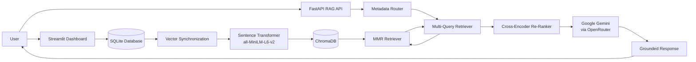
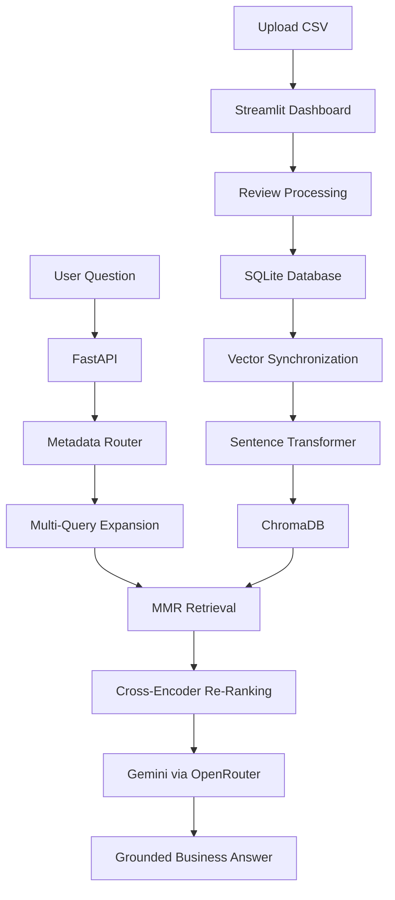

# 📊 BizInsight AI

[](https://www.python.org/downloads/)
[](https://streamlit.io)
[](#-testing)
[](LICENSE)

BizInsight AI is an **AI-powered customer feedback analytics platform** that helps businesses understand customer sentiment, detect emerging risks, cluster complaints, and ask AI-powered questions about review data — all from a single dashboard.

> **What makes it different?** Most analytics tools are *reactive* — you notice problems only after manually inspecting charts. BizInsight AI is *proactive*: it **automatically detects negative sentiment spikes, identifies recurring complaint keywords, and assigns a risk level** so you catch problems early.

---

## 🚀 Features

| Feature | Description |
|---------|-------------|
| 📂 **CSV Upload** | Upload customer reviews and auto-score sentiment |
| 📊 **Dashboard** | Satisfaction trends, sentiment distribution, top keywords, pie charts |
| ⚠️ **Trend Alert & Risk Detection** | Automatic spike detection, risk scoring (High/Medium/Low), recurring complaint keywords |
| 🔍 **Smart Complaint Clustering** | Groups negative reviews into categories using BERTopic + HDBSCAN |
| 🤖 **AI Business Assistant** | Ask natural language questions about your reviews |
| 🧠 **RAG Chatbot** | Conversational AI grounded in your actual review data (FastAPI + ChromaDB) |
| ⬇️ **CSV Export** | Download processed feedback data |


---

## ⚠️ Trend Alert & Risk Detection (New Feature)

The alerts module makes BizInsight AI **proactive** by automatically flagging problems before they escalate.

### How it works

1. **Time-windowed analysis** — Compares the last 7 days of reviews against the prior 7-day baseline.
2. **Negative sentiment tracking** — Calculates the percentage of reviews with `sentiment < 0`.
3. **Spike detection** — Flags a spike when the negative % jumps by ≥ 15 points vs baseline.
4. **Risk scoring** — Assigns a risk level based on thresholds:

   | Level | Condition |
   |-------|-----------|
   | 🟢 Low | < 40% negative AND < 15% delta |
   | 🟡 Medium | ≥ 40% negative OR ≥ 15% delta |
   | 🔴 High | ≥ 60% negative OR ≥ 30% delta |

5. **Risk keywords** — Extracts top recurring complaint terms using TF-IDF on negative reviews.
6. **Insufficient data warning** — Warns when < 5 reviews exist in the recent window.

### What you see in the dashboard

- **Risk banner** — Color-coded alert (green/yellow/red) with actionable message
- **Metric cards** — Risk score, recent negative %, review count, spike indicator
- **Keyword badges** — Top 8 risk keywords highlighted for quick scanning
- **Methodology expander** — Full breakdown of how the score is calculated

---

## 🔍 Smart Complaint Clustering

Automatically groups negative reviews into meaningful categories using unsupervised ML:

1. **Embedding** → Sentence-Transformer (`all-mpnet-base-v2`)
2. **Dimensionality reduction** → UMAP (5 components, cosine distance)
3. **Clustering** → HDBSCAN (density-based, auto noise detection)
4. **Topic extraction** → BERTopic with c-TF-IDF
5. **Category mapping** → Maps to 11 predefined categories (Payment, Delivery, Technical, etc.) or generates dynamic names

---

## 🧠 RAG Chatbot

A conversational AI that answers business questions grounded **only** in your uploaded reviews.

- **Vector Store** — ChromaDB with `all-MiniLM-L6-v2` embeddings
- **Smart Retrieval** — Sentiment-aware filtering + multi-query expansion + cross-encoder re-ranking
- **Grounded Answers** — LLM instructed to answer only from provided context
- **Session Memory** — Follow-up questions with conversation history

---

## 🛠 Tech Stack

| Layer | Technologies |
|-------|-------------|
| **Frontend** | Streamlit |
| **Sentiment** | VADER, RoBERTa (BERT ensemble available in `sentiment.py`) |
| **Clustering** | BERTopic, HDBSCAN, UMAP, Sentence-Transformers |
| **RAG** | LangChain, ChromaDB, HuggingFace Embeddings, FastAPI |
| **LLM** | OpenRouter (DeepSeek / Google Gemini) |
| **Database** | SQLite |
| **Alerts** | Pandas, scikit-learn (TF-IDF) |

---

## 📂 Project Structure

```
BizInsight-AI/
├── app.py                  # Main Streamlit application (6 tabs)
├── alerts.py               #  Trend Alert & Risk Detection module
├── database.py             # SQLite CRUD layer
├── sentiment.py            # VADER + BERT ensemble scorer
├── pdf_generator.py        # PDF report generator
├── sync_vectors.py         # CLI tool to sync SQLite → ChromaDB
├── run_chatbot_api.py      # FastAPI server launcher
├── requirements.txt        # Python dependencies
├── .env.example            # Environment variable template
│
├── clustering/             # Complaint clustering pipeline
│   ├── run_clustering.py   # Full pipeline: embed → UMAP → HDBSCAN → BERTopic
│   ├── vectorize.py        # Sentence-transformer model loading
│   └── preprocess.py       # Text cleaning for clustering
│
├── rag_api/                # RAG chatbot backend
│   ├── api.py              # FastAPI endpoints (/chat, /sync)
│   ├── chains.py           # LangChain RAG chain with memory
│   ├── vector_store.py     # ChromaDB integration
│   ├── embeddings.py       # HuggingFace embeddings
│   └── config.py           # Configuration constants
│
├── tests/                  # Test suite
│   ├── test_alerts.py      # 38 tests for alerts module
│   ├── test_database.py    # 18 tests for database layer
│   └── alerts_test_reviews.csv
│
├── data/
│   └── reviews.csv         # Sample review data
└── docs/
    └── ARCHITECTURE.md     # Architecture documentation
```

---

# 🏗️ Architecture & Data Flow

BizInsight AI uses a modular **Retrieval-Augmented Generation (RAG)** architecture that combines **Streamlit**, **FastAPI**, **SQLite**, **ChromaDB**, **Sentence Transformers**, and **Google Gemini (via OpenRouter)** to provide grounded answers based only on uploaded customer reviews.

The system separates data storage, vector search, retrieval, and language generation into independent components, making it easier to maintain and extend.

---

## System Architecture


---

## Architecture Components

## 1. Streamlit Dashboard

The Streamlit application acts as the primary user interface.

It allows users to:

- Upload customer review CSV files
- Run sentiment analysis
- Explore business analytics
- Launch complaint clustering
- Interact with the AI chatbot

Uploaded reviews are processed before being stored in SQLite.

---

## 2. SQLite Database

SQLite serves as the application's persistent storage layer.

It stores:

- Customer reviews
- Sentiment values
- Upload timestamps
- User information
- Chat history

The vector database is built using review data stored in SQLite.

---

## 3. Vector Synchronization

The project includes two synchronization mechanisms:

- `sync_vectors.py`
- FastAPI `/sync` endpoint

Both convert customer reviews into LangChain `Document` objects before generating embeddings and storing them inside ChromaDB.

Each document contains:

- Review text
- Sentiment metadata
- Upload date
- Review ID

> **Note:** CSV uploads store reviews in SQLite. Vector synchronization is performed separately through the provided synchronization utilities.

---

## 4. Embedding Generation

Every customer review is converted into a dense vector using:

```text
all-MiniLM-L6-v2
```

The embedding model is loaded only once and reused throughout the application to reduce initialization overhead and improve performance.

Embeddings are normalized before storage to improve similarity search quality.

---

## 5. ChromaDB Vector Store

Embedded reviews are stored inside a persistent ChromaDB collection.

Configuration includes:

- Persistent storage directory
- Collection name
- Metadata storage
- Maximum Marginal Relevance (MMR) retrieval

Each stored vector retains metadata, allowing efficient filtering during retrieval.

Example metadata:

- Sentiment
- Date
- Review ID

---

## 6. FastAPI Backend

The FastAPI backend exposes the chatbot API.

Available endpoints include:

| Endpoint | Purpose |
|----------|----------|
| `/chat` | Answer questions using RAG |
| `/sync` | Synchronize documents into ChromaDB |
| `/health` | Check API and vector store health |

The backend coordinates:

- Retrieval
- Query expansion
- Re-ranking
- Prompt generation
- LLM inference

---

## 7. Smart Metadata Router

Before retrieval begins, the backend analyzes the user's question.

If the question indicates **negative intent**, retrieval is restricted to reviews with negative sentiment.

Examples include:

- issue
- problem
- complaint
- broken
- bad

If the question indicates **positive intent**, retrieval is restricted to positive reviews.

Examples include:

- good
- great
- best
- awesome
- love

If no sentiment is detected, the retriever searches across all reviews.

This improves retrieval precision without requiring additional prompts.

---

## 8. Maximum Marginal Relevance (MMR) Retrieval

Instead of performing a standard similarity search, the retriever uses **Maximum Marginal Relevance (MMR)**.

MMR balances:

- similarity
- diversity

This helps avoid retrieving multiple nearly identical reviews while still preserving relevance.

---

## 9. Multi-Query Expansion

The chatbot uses LangChain's **MultiQueryRetriever**.

Instead of searching with only the original question, multiple semantic variations are generated.

For example:

User question:

> Why are customers unhappy with delivery?

Possible search variants:

- Delivery complaints
- Shipping delays
- Late deliveries
- Courier problems

Searching multiple semantic variants improves recall and increases the likelihood of retrieving useful reviews.

---

## 10. Cross-Encoder Re-Ranking

Retrieved reviews are passed through the Hugging Face Cross-Encoder:

```text
cross-encoder/ms-marco-MiniLM-L-6-v2
```

Unlike vector similarity, the cross-encoder jointly evaluates the user's question and every retrieved review.

The highest-scoring reviews are selected before sending context to the language model.

This additional ranking stage significantly improves response quality.

---

## 11. LLM Response Generation

The selected customer reviews are inserted into a carefully designed prompt before being sent to:

```text
Google Gemini
(via OpenRouter)
```

The prompt instructs the model to:

- Use only retrieved customer reviews
- Avoid making unsupported claims
- Return a fallback response if evidence is unavailable

When no supporting review exists, the chatbot responds with:

> "The customer reviews do not mention this information."

This ensures grounded and reliable answers.

---

## 12. Conversation Memory

For conversational sessions, BizInsight AI maintains context using conversation memory.

Conversation history is preserved using:

- Session IDs
- SQLite chat history
- Memory window configuration

This enables follow-up questions without requiring users to repeat previous context.

---

## Data Flow

The following diagram illustrates how customer reviews move through the RAG pipeline.



---

## End-to-End RAG Pipeline

### Step 1 — Upload Customer Reviews

Users upload customer review CSV files through the Streamlit dashboard.

The application processes the reviews, performs sentiment analysis, and stores the processed records inside SQLite.

---

### Step 2 — Synchronize the Vector Store

Stored reviews are converted into LangChain `Document` objects.

Each document includes:

- Review text
- Sentiment
- Timestamp
- Review identifier

The synchronization utilities generate embeddings for every review and store them in ChromaDB.

---

### Step 3 — Ask a Business Question

Users submit natural language questions through the chatbot.

Example:

> What are the most common delivery complaints?

---

### Step 4 — Metadata Routing

The backend first determines whether the question has positive or negative intent.

Depending on the detected intent, retrieval is optionally filtered using sentiment metadata stored inside ChromaDB.

---

### Step 5 — Expand the Query

The Multi-Query Retriever generates multiple semantic variations of the user's question.

This increases retrieval recall by searching for conceptually similar wording across the review collection.

---

### Step 6 — Retrieve Candidate Reviews

Relevant reviews are retrieved using **Maximum Marginal Relevance (MMR)**, balancing similarity with diversity to reduce duplicate context.

---

### Step 7 — Re-Rank Retrieved Reviews

Candidate reviews are scored using the Hugging Face Cross-Encoder model.

Only the most relevant reviews are retained for the final context.

---

### Step 8 — Generate the Final Response

The selected reviews are inserted into the LLM prompt and sent to Google Gemini through OpenRouter.

The model generates a business-focused response using only the supplied customer review context.

If no relevant information is found, the predefined fallback response is returned.

---

## Component Interaction Summary

| Component | Responsibility |
|-----------|----------------|
| **Streamlit** | User interface, CSV uploads, analytics dashboard |
| **SQLite** | Persistent storage for reviews and chat history |
| **Vector Synchronization** | Converts stored reviews into LangChain documents |
| **Sentence Transformer** | Generates dense vector embeddings (`all-MiniLM-L6-v2`) |
| **ChromaDB** | Persistent vector database |
| **FastAPI** | RAG backend and API endpoints |
| **Metadata Router** | Applies sentiment-aware filtering before retrieval |
| **MMR Retriever** | Retrieves relevant and diverse customer reviews |
| **Multi-Query Retriever** | Improves retrieval recall using query expansion |
| **Cross-Encoder** | Re-ranks retrieved reviews by semantic relevance |
| **Google Gemini (OpenRouter)** | Generates grounded business answers |
| **Conversation Memory** | Preserves conversational context across sessions |

---

## 📥 Installation & Setup

### 1. Clone the Repository

```bash
git clone https://github.com/Rajarshisaha10/BizInsight-AI.git
cd BizInsight-AI
```

### 2. Set Up a Virtual Environment

**Using venv (recommended):**
```bash
python -m venv venv

# Windows
venv\Scripts\activate

# macOS / Linux
source venv/bin/activate
```

**Using conda:**
```bash
conda create --name bizinsight python=3.10 -y
conda activate bizinsight
```

### 3. Install Dependencies

```bash
pip install -r requirements.txt
```

### 4. Set Up Environment Variables

1. Get a free API key from [OpenRouter](https://openrouter.ai/)
2. Copy the example env file:
   ```bash
   # macOS / Linux
   cp .env.example .env

   # Windows
   copy .env.example .env
   ```
3. Add your key to `.env`:
   ```
   OPENROUTER_API_KEY=your_api_key_here
   ```

> ⚠️ Never commit your `.env` file. It is already in `.gitignore`.

### 5. Run the Application

```bash
streamlit run app.py
```

### 6. (Optional) Start the RAG Chatbot Backend

In a separate terminal:
```bash
python run_chatbot_api.py
```

---

## 📄 CSV Format

Your CSV file must contain a column named `review`:

```csv
review
"The product quality is amazing, will buy again!"
"Shipping was late and the item arrived damaged."
"Decent for the price, nothing special."
```
---

## 🐳 Run with Docker

You can run BizInsight AI in a container with no local Python setup.

### 1. Set your API key
Either create a `.env` file in the project root:
```bash
echo "OPENROUTER_API_KEY=your_api_key_here" >> .env
```
or export it directly in your shell (useful for CI/CD or production):
```bash
export OPENROUTER_API_KEY=your_api_key_here
```

### 2. Build and start the app
```bash
docker compose up --build
```

The dashboard will be available at **http://localhost:8501**.

### Notes
- Customer feedback data and vector embeddings are stored in Docker-managed named volumes, so they persist across `docker compose down` / `up` and rebuilds. To fully reset, run `docker compose down -v`.
- The first build installs several large ML dependencies (PyTorch, Transformers, ChromaDB, etc.) and can take a while — subsequent builds are cached and much faster.
- To stop the app: `docker compose down`

---

## 🧪 Testing


The project includes **56 automated tests** covering the alerts module and database layer.

```bash
# Run all tests
python -m pytest tests/ -v

# Run only alerts tests
python -m pytest tests/test_alerts.py -v

# Run only database tests
python -m pytest tests/test_database.py -v
```

### Test Coverage

| Module | Tests | Areas Covered |
|--------|-------|---------------|
| `alerts.py` | 38 | Risk scoring, spike detection, keyword extraction, DB integration, edge cases, constants |
| `database.py` | 18 | Table creation, CRUD operations, validation, unicode, ordering |

---

## 📈 Example Use Cases

- E-commerce customer experience monitoring
- Service quality trend analysis
- Product feedback insights and issue detection
- Early warning system for customer satisfaction drops
- Competitive analysis through review data

---

## 🏆 Why BizInsight AI?

Manually analyzing customer feedback is time-consuming and error-prone. BizInsight AI converts raw reviews into **actionable business intelligence** using AI — and now, with the Trend Alert system, it **catches problems before you do**.

---

## 📌 Future Enhancements

- Multi-business login system
- Automated PDF report generation
- Email / Slack notifications for high-risk alerts
- Historical alert timeline and trend tracking
- Category-level risk breakdown

---

## 👨‍💻 Contributors

Built by **Prateek Singh** & **Rajarshi Saha**
BTech Students | AI & Software Development Enthusiasts

---

⭐ If you like this project, consider giving it a star!

## ✨ README Improvement Notes

### 📌 Formatting Enhancements Needed
- Improve heading hierarchy for better readability
- Ensure consistent spacing between sections
- Use proper Markdown formatting for code blocks and lists
- Align all installation and usage steps properly

### 🚀 Suggested Structure Upgrade
- Introduction
- Features
- Tech Stack
- Installation
- Usage
- Project Structure
- Contribution Guidelines
- License

### 🛠️ Documentation Improvements
- Add badges (optional): build, license, contributors
- Add screenshots for better UI understanding
- Standardize code blocks for commands

### 🎯 Goal
Improve onboarding experience for new contributors and users by making README more structured, readable, and professional

